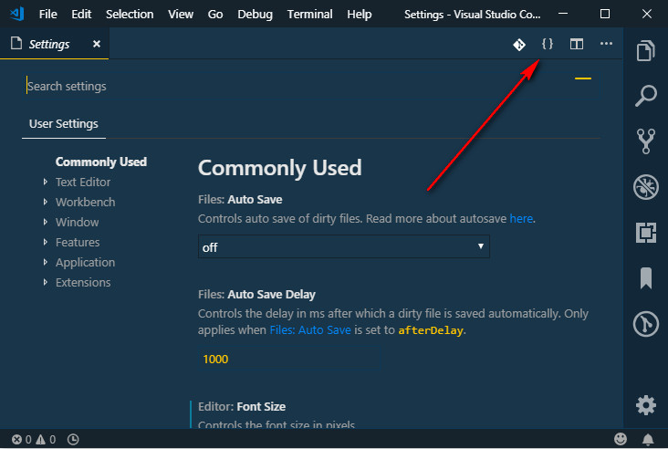

# ESLint and Prettier Configuration

ESLint and Prettier Configuration I use on VS Code. Inspired by [wesbos'](https://github.com/wesbos/eslint-config-wesbos)

Works on:
- React
- styled-components in react

## Installation
1. Make sure your project already has a `package.json`, if not create one using `npm init`.

2. Install dependencies needed by the config.
```
npx install-peerdeps --dev eslint-config-iamdevlinph
```

Note: If you're using yarn, `npx` will ask if you want to use it for the installation. At least on `npm -v 6.4.1`.


3. Some dependencies will be added to your `devDependencies`.

4. Create a `.eslintrc` file in the root of your project.
```
{
  "extends": [
    "iamdevlinph"
  ]
}
```
Or `.eslintrc.js`
```
module.exports = {
  "extends": [
    "iamdevlinph"
  ],
};
```

5. Customize the configuration.
```
{
  "extends": [
    "iamdevlinph
  ],
  "rules": {
    "react/jsx-filename-extension": 0,
    "import/prefer-default-export": 0
  },
  "globals": {
    "firebase": true,
    "window": true
  },
}

```

6. Add some scripts to your `package.json`.
```
"scripts": {
  "lint": "eslint .",
  "lint:fix": "eslint . --fix"
}
```

7. Create a `.eslintignore` beside `.eslintrc` and ignore the usual folders
```
**/node_modules/*
```

## Using with VS Code
1. Install [ESLint extension](https://marketplace.visualstudio.com/items?itemName=dbaeumer.vscode-eslint)

2. Press `Ctrl + ,` to open your `settings.json` then click on the `{}` on the upper right corner to enter the `.json` format.



And copy the settings below:
```
"editor.formatOnSave": true,
"eslint.autoFixOnSave": true,
"[javascript]": {
  "editor.formatOnSave": false
},
"[javascriptreact]": {
  "editor.formatOnSave": false
},
```
